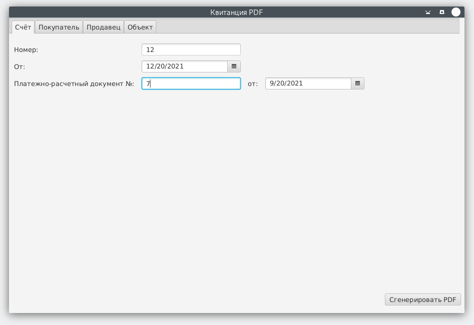
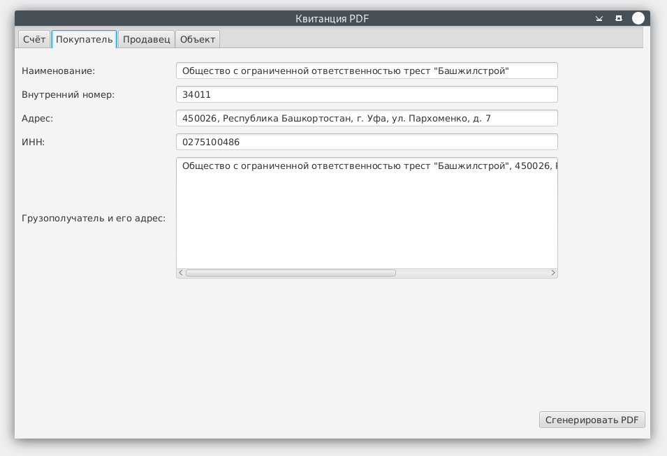
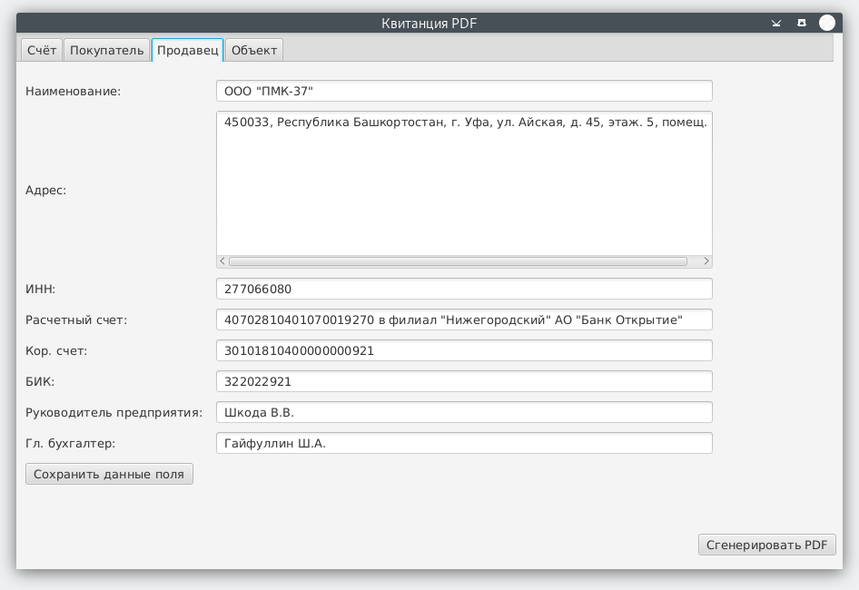
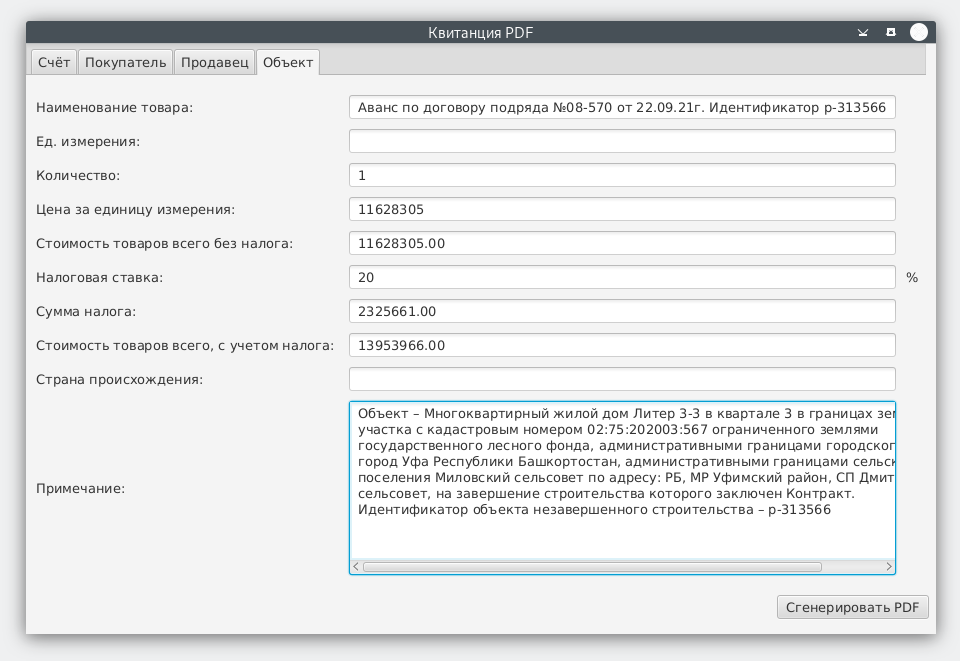
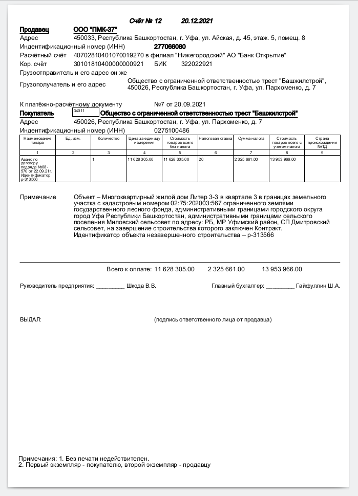
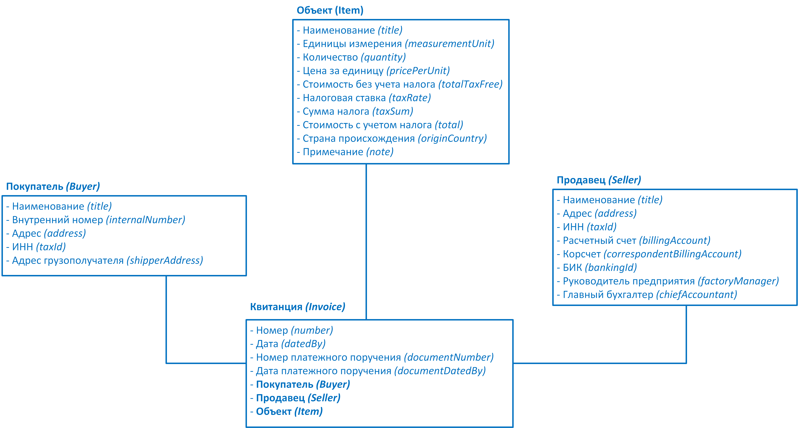

## Приложение на JavaFX для генерации PDF-квитанций строительных объектов 

Для создания PDF-документов используется библиотека **iText 5**. 

Хранение значений полей по умолчанию для автозаполнения — база данных **SQLite**.

#### Процесс создания квитанции:

**1)** Заполнение полей *Счёта*:


**2)** Ввод данных о *Покупателе*:


**3)** Поля *Продавца* заполняются автоматически — из данных в БД:

Кнопка «*Сохранить данные поля*» — сохранит текущие значения полей как значения по умолчанию.

**4)** Заполнение полей *Объекта*:

Поля сумм рассчитываются автоматически.

После нажатия на кнопку «*Сгенерировать PDF*» — создается соответствующий PDF-документ:

___
#### Иерархия используемых классов:


---
Исполняемый архив **pdf-invoice-jar-with-dependencie.jar** содержит все необходимые зависимости. Запуск архива:
> java -jar pdf-invoice-jar-with-dependencies.jar
___
Внешние файлы:
- **database.properties** (содержит путь к БД) 
- и файл БД **pdf_invoice_defaults.db**

необходимы для сохранения значений по умолчанию для автозаполнения.

Поля таблицы БД:
 - text : **title** (*Наименование*)
 - text : **address** (*Адрес*)
 - text : **tax_id**  (*ИНН*)
 - text : **billing_account** (*Расчётный* *счёт*)
 - text : **correspondent_billing_account** (*Корсчёт*)
 - text : **banking_id** (*БИК*)
 - text : **factory_manager** (*Руководитель предприятия*)
 - text : **chief_accountant** (*Главный бухгалтер*)
___
Зависимости в **pom.xml**:
``` 
<dependencies>
   <dependency>
      <groupId>org.openjfx</groupId>
        <artifactId>javafx-controls</artifactId>
        <version>17.0.0.1</version>
    </dependency>
    <dependency>
        <groupId>org.openjfx</groupId>
        <artifactId>javafx-fxml</artifactId>
        <version>17.0.0.1</version>
    </dependency>
    <dependency>
        <groupId>org.xerial</groupId>
        <artifactId>sqlite-jdbc</artifactId>
        <version>3.36.0.3</version>
    </dependency>
    <dependency>
        <groupId>com.itextpdf</groupId>
        <artifactId>itextpdf</artifactId>
        <version>5.5.13.2</version>
    </dependency>
    <dependency>
        <groupId>commons-io</groupId>
        <artifactId>commons-io</artifactId>
        <version>2.6</version>
    </dependency>
</dependencies>
```

